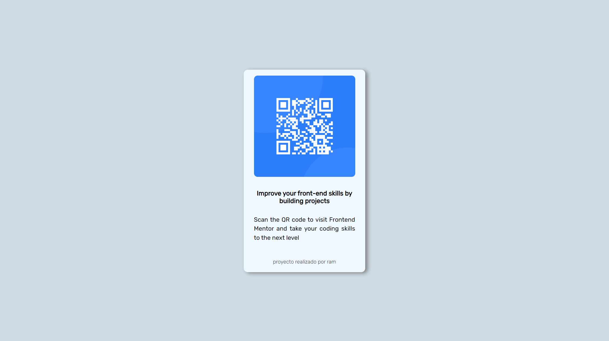

## Componente de QR Code

### Tabla de contenido

- [Overview](#overview)
- [Trabajo](#trabajo)

##

### Overview

Una etiqueta con un código de QR y mensaje. 

### Trabajo

Esto fue trabajado con HTML y CSS.
